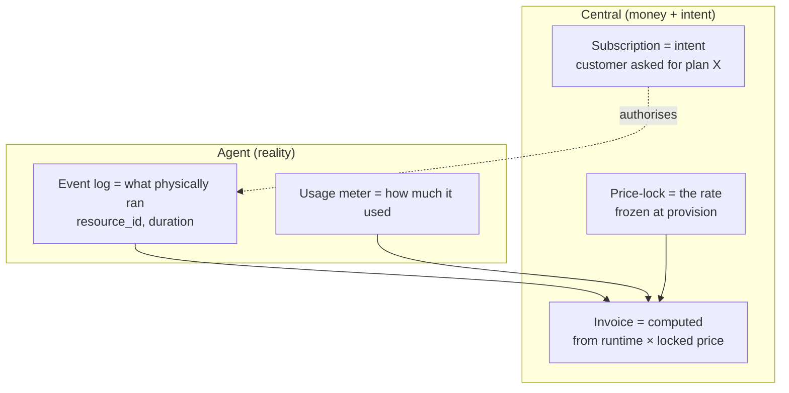

# 01 — Overview

## What this app is

**Billing** is the **Central** half of Frappe Cloud v2's billing system — the
**sole system of record for money**. It is a redesign of the v1 (Press) billing
layer, not a patch on it.

It owns:

- **Catalog** — plans (flat-rate bundles), add-ons, and per `(plan, cluster,
  currency)` rates.
- **Subscriptions** — the customer's *intent* (which plan, which region).
- **Invoices** — two-phase monthly generation, line items, tax, state machine.
- **Credits** — append-only ledger + per-team wallet.
- **Payments** — payment methods, gateway charges, webhooks, retries.
- **Trust tiers & entitlement tokens** — the cap on what a team may provision.
- **Lifecycle** — dunning, suspension, refunds, reconciliation, trials.
- **Dashboards** — customer portal and admin console (Frappe-UI SPA).

It is the **only** component that talks to payment gateways.

## What it is *not*

It does **not** decide what actually ran. That is the job of the **Subscription
Agent**, a deliberately thin app that lives on each regional cluster. The Agent
records an immutable event log (`subscribed` / `changed` / `cancelled`, with a
`resource_id` and the `shown_rate`), records usage rollups, enforces
Central-issued entitlement tokens offline, and syncs back to Central. It holds
**no** financial logic and never calls a gateway.

## The mental model

The killer consequence: a request that never provisioned, or a machine that was
terminated mid-month, bills exactly for the time it ran — not for the *intent*.
This eliminates v1's "billed for things that weren't running" class of bug.

## Why v2 exists (the problems it fixes)

| v1 problem | v2 fix |
|---|---|
| Prepaid credits as a scalar field → negative, unauditable balances | Append-only **Credit Ledger** + **Credit Wallet** anchor; balance = ledger sum, `FOR UPDATE`-safe |
| 10M+ usage rows/day | **Edge-aggregated** metering on the Agent; Central stores bounded rollups |
| "Pay Now" on locked invoices, no state machine | **Invoice state machine**; `Paid` only on a verified webhook |
| Webhook signature checked *after* DB lookup (enumeration) | **Signature-first** receiver — verify HMAC before any DB access |
| Credit double-spend under concurrency | `FOR UPDATE` ledger booking |
| Thousands of synchronous ERPNext syncs | **Async, one-way, failure-isolated** Sales Invoice sync |
| Single blocking 1st-of-month invoice loop | **Two-phase** parallel generation (28th draft / 1st open) |

## Cross-cutting design rules

These hold everywhere; if you are extending the app, do not break them.

- **Pure postpaid / in-arrears.** Everything bills on the 1st for the month just
  ended, including the partial first month. No charge at sign-up.
- **Money is integer minor units.** Paisa for INR, cent for USD, stored as 64-bit
  ints. Per-unit *rates* are stored at minor × 10⁶ ("rate units") to represent
  sub-paisa meters. Round once, per line item. See ADR 0003 (money as integer
  minor units) and the [glossary](07-glossary.md).
- **Two orthogonal state axes.** Operational (`running`/`stopped`/`terminated`,
  on the Agent) vs account standing (`current`/`past_due`/`suspended`, on
  Central). Never collapse them into one enum.
- **Trust tier is the cap.** What a team may provision is bounded by its trust
  tier, computed from billing history.
- **Webhook-first, signature-first.** Verify the gateway HMAC as the *first*
  operation.
- **Adapter pattern for gateways.** Core logic never imports gateway SDK code.
- **Idempotency everywhere.** Gateway calls carry idempotency keys derived from
  `payment_attempt.name`; webhooks dedupe on `gateway_event_id`.
- **Append-only ledgers.** Credit ledger and price-lock are append-only; balances
  are computed from sums, never stored as scalars.

## The two apps & sites

| | App | Dev site | Role |
|---|---|---|---|
| **Central** | `billing` (this repo) | `billing.local` | Money + intent SOR |
| **Agent** | `press_billing_agent` | `agent.local` | "What ran" SOR |

Next: [02 — Onboarding](02-onboarding.md) to stand it up.
