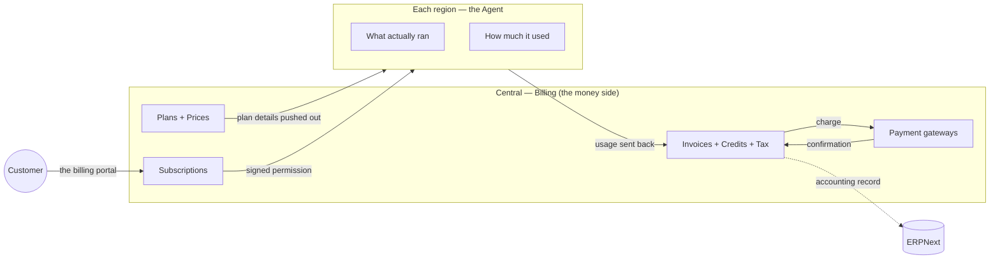
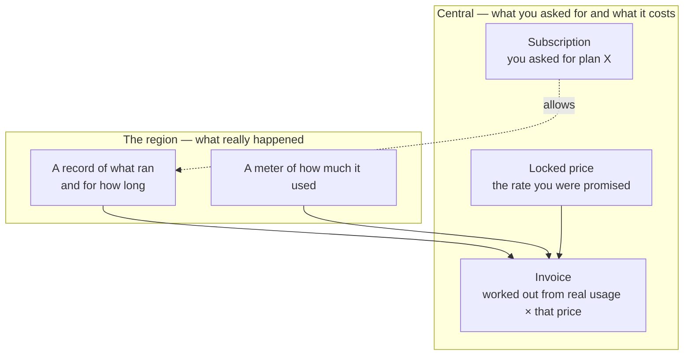
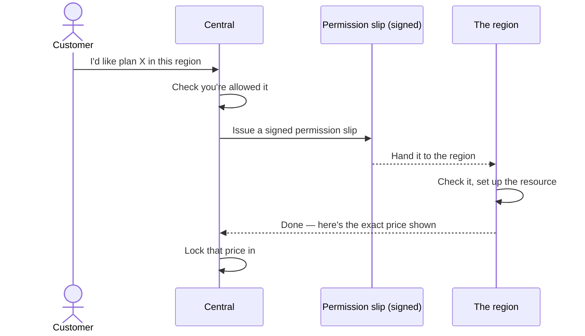
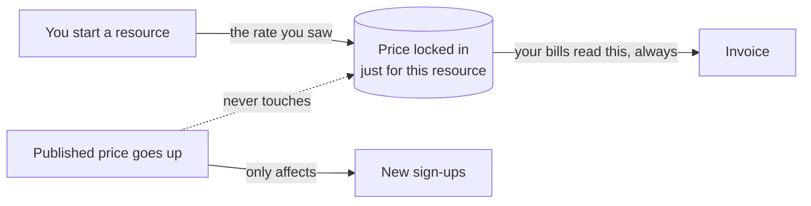
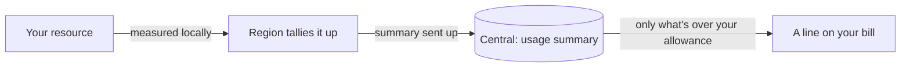
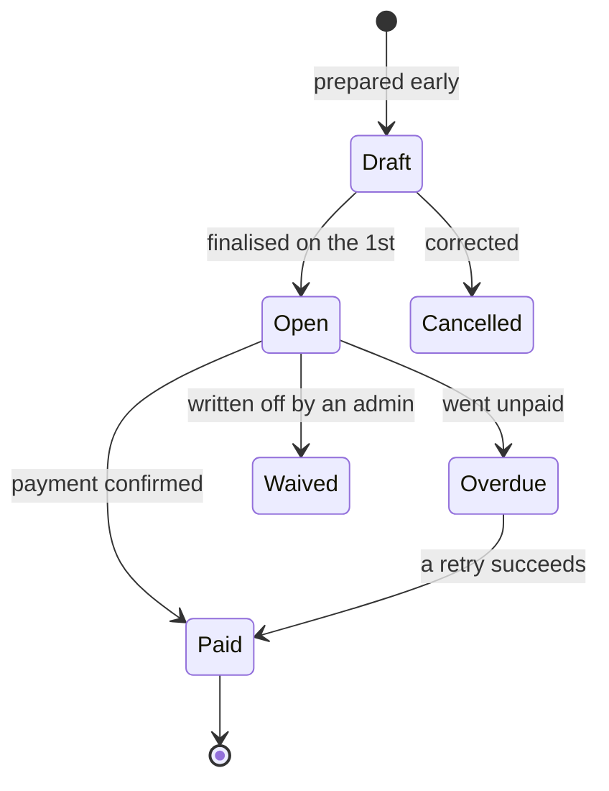
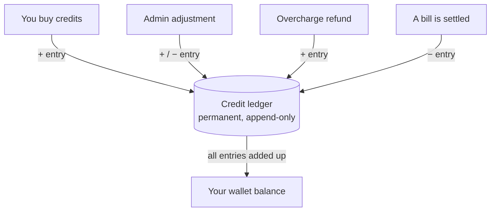
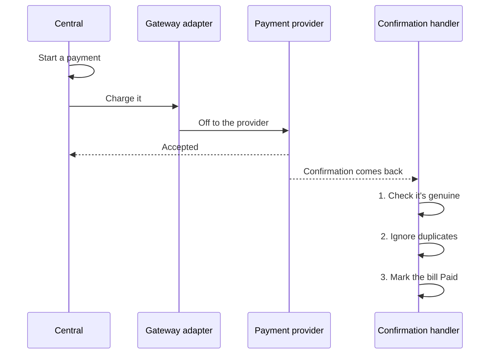
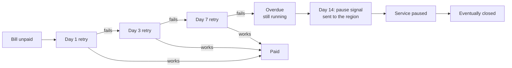
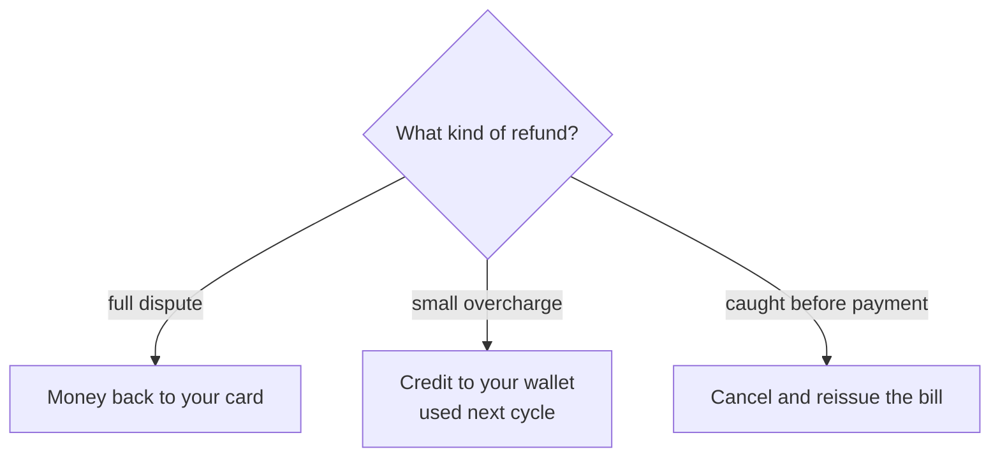

# Billing, Explained

## What we're building

Billing is the part of Frappe Cloud that handles money. When you run apps and
servers on the cloud, something has to keep track of what you signed up for, what
you actually used, what that costs, and how you pay for it. That's this. It owns
your plans and prices, your subscriptions, your invoices, your credits, the
taxes, and the connection to whichever payment provider charges your card. It is
the single place where all of that comes together.

The whole thing is built around one simple idea. The cloud runs in regions all
over the world, and each region has a small companion — the **Agent** — that
quietly watches what actually ran there. Billing, which we call **Central**,
keeps track of what you *asked for* and handles all the money. You can request a
plan, but you're only ever billed for what really ran. That distinction is the
heart of the system.

A few choices shape the feel of the product. You're billed at the end, not the
start — on the 1st of each month, for the month just gone, with nothing charged
when you sign up. Your invoice isn't a number someone typed in; it's worked out
from what the region recorded multiplied by the price you were promised. And all
the maths is done in whole paisa and cents, so the totals are always exact.

## You pay for what ran, not what you asked for

It's worth slowing down on this, because it's the thing that makes Billing feel
fair. Asking for a plan and actually using it are two different events. You tell
Central what you want; the region tells Central what really happened. The bill
comes from where those two meet.

So if a server you requested never actually started, you don't pay for it. If a
machine was switched off halfway through the month, you pay for the half it ran,
not the whole month. The bill follows reality, every time.

## The features, and how each one works

Everything below is a feature you can point at in the product. Each comes with a
picture of how it actually moves.

### Signing up for a plan

When you subscribe, Central checks you're allowed the plan, then hands the region
a signed permission slip to go and set it up. The region can act on that slip on
its own, even if Central is briefly unreachable — so a hiccup on our side never
stops your servers. The moment it's set up, the region reports back the exact
price you were shown, and Central locks it in.

### The price you saw is the price you keep

Once you've been quoted a rate for a resource, that rate is frozen for as long as
you keep it. If we later raise the published price, it only touches *new*
sign-ups — never yours. The single exception is things that naturally get cheaper
over time, like older storage, where you actually benefit from the current rate.

### Metering what you use

Some things are billed by usage. Rather than shipping every tiny measurement back
to Central, each region tallies it up locally and sends a tidy summary. You get a
free allowance built into your plan, and you only pay for usage above it.

### How your monthly bill comes together

Because everyone is billed at month end, we don't try to do it all in one rush.
A draft of your bill is quietly prepared a few days early, then finalised on the
1st. Every line is worked out from real usage and your locked prices, and you get
one bill per region you're in. A bill moves through clear stages, and only ever
counts as paid once the payment is genuinely confirmed.

### Buying credits, and a wallet that always adds up

You can pay as you go, or you can put money on account ahead of time as credits.
The thing we care about most here is trust: the balance in your wallet has to be
something you can rely on, down to the last paisa. So instead of keeping a single
number we keep nudging up and down, we keep a ledger — a permanent, ordered list
where every credit you buy and every bit you spend is its own entry that's never
edited or erased. Your balance is simply that list added up. Because nothing is
ever overwritten, the running total can't quietly drift, and you can always trace
exactly where every credit came from and where it went.

Buying credits is the same simple two-step you'd expect — we set up the purchase
with the payment provider, and the moment it's confirmed, a credit entry lands in
your ledger and your balance goes up. Spending them is just the other direction:
when a bill is settled from your wallet, that's a matching entry going out. Two
people (or two jobs) can never accidentally spend the same credit twice — the
wallet is locked for the instant a spend is recorded, so the books always
balance.

### Paying — credits first, then your card

When a bill opens, any credits in your wallet are used first, and only the
remainder goes to your card. A payment is confirmed straight from the provider,
which is the only thing that marks a bill as paid. If your main card fails, we try
your next saved method rather than hammering the same one — moving down your list,
not in circles.

### When a payment doesn't go through

If a bill goes unpaid, we don't pull the plug on day one. We retry over the
following days, then mark it overdue, and only after a clear grace period do we
pause the service. Crucially, pausing is a deliberate signal sent to the region —
nothing on our side merely timing out will ever switch off your servers. Until
that deliberate signal arrives, an overdue account keeps running.

### Refunds

Refunds come in two shapes. If you've been charged for something disputed in
full, the money goes straight back to your card. If you were merely overcharged a
little, it lands as a credit in your wallet for next time. And if we catch a
mistake before you've even paid, we simply cancel the bill and reissue a correct
one.

### Free trials

A trial is just the entry level of the service. During it, we still work out what
you *would* have paid and show it to you — but we don't charge it. When you decide
to convert, your bill simply switches to real charging and nothing you've built
gets disturbed.

### A safety net behind the scenes

A couple of quiet jobs keep things honest. One checks every day for payments that
went through at the provider but whose confirmation got lost in transit, and
settles them up so nothing falls through the cracks. Another sends every paid bill
across to our accounting system as a proper record — and if that ever fails, it
just retries; it can never undo or change your actual bill.

## What you can do day to day

If you're a **customer**, you live in the billing portal: see where your account
stands and what's coming, look at a forecast of this month's bill before it lands,
browse past invoices and your credit history, and manage how you pay — adding
cards, choosing a default, setting which to fall back to, paying a bill, or
topping up credits.

If you're an **admin**, you get the wider view: revenue and trends, who's paying
on time and who isn't, where usage is concentrated, and control over the plans and
prices themselves. Changing a published price is safe by design — it only ever
applies to new sign-ups, and everyone already on the old rate keeps it.

And running underneath all of it, on their own schedule, are the everyday jobs
that chase unpaid bills, reconcile lost confirmations, keep the accounting records
in step, and tidy up as they go — so the system mostly looks after itself.

---

*Want the engineering detail? See [03 — Architecture](03-architecture.md),
[05 — Workflows](05-workflows.md), and [06 — Actions & API reference](06-actions.md).*
</content>
