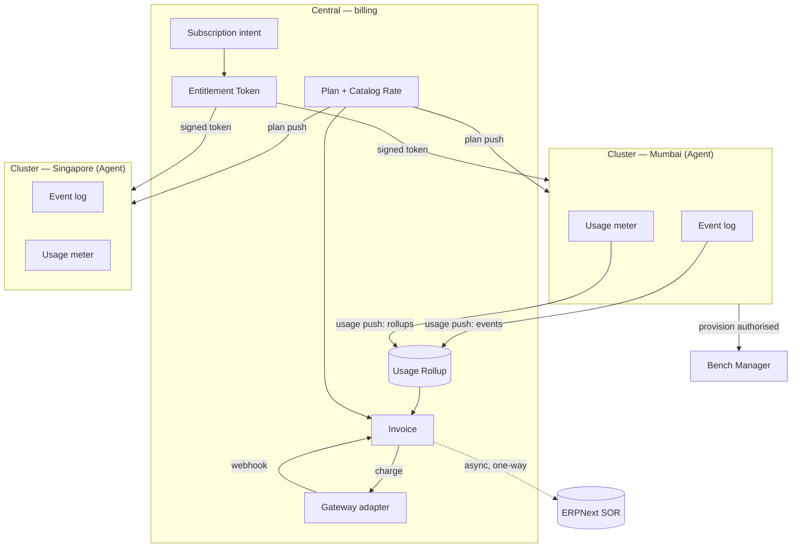
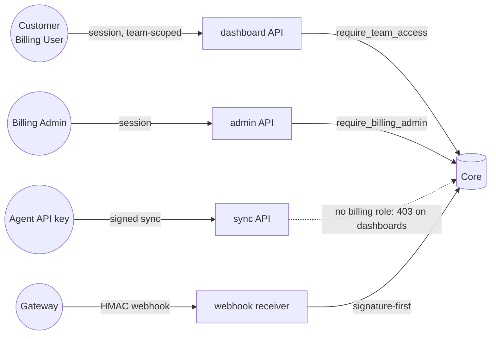

# 03 — Architecture

How the code is organised, where each concern lives, and how data flows.

## Code layout

All Python lives under `billing/` (the inner module). Each sub-package is one
bounded concern:

```
billing/
├── hooks.py              App wiring: routes, scheduler, after_migrate
├── api/                  HTTP surface (whitelisted endpoints)
│   ├── dashboard/        Customer portal endpoints (team-scoped)
│   │   ├── account.py        whoami, overview, trust tier, billing profile
│   │   ├── invoices.py       forecast, invoices, credits, pay_invoice, top-up
│   │   └── methods.py        payment-method CRUD, card setup
│   └── admin/            Admin console endpoints (Billing Admin only)
│       ├── revenue.py        MRR, trends, aging, analytics
│       ├── teams.py          team list, metrics, delinquency
│       └── catalog.py        catalog view, update_plan_rate, consumption
├── catalog/              The "what we sell" domain
│   ├── plans.py              bundles + configured plans
│   ├── pricing.py            rate resolution (cluster × currency)
│   ├── subscriptions.py      subscription intent + two-axis state
│   ├── entitlements.py       trust-tier cap → entitlement token
│   ├── signing.py            Ed25519 token signing
│   ├── commitments.py        spend-floor commitment + clawback
│   └── trials.py             trial = entry tier, cost_report
├── revenue/              The "what we charge" domain
│   ├── invoicing/
│   │   ├── generate.py       two-phase draft/open generation
│   │   ├── lines.py          line-item construction (fixed + metered)
│   │   └── lifecycle.py      invoice state transitions
│   ├── pricelock.py          append-only grandfathering record
│   ├── metering.py           usage rollup → metered line items
│   ├── credits.py            append-only ledger + wallet
│   ├── tax.py                GST / SEZ / TDS three-mechanic model
│   ├── dunning.py            retry → suspend → terminate ladder
│   └── erpnext_sync.py       async one-way Sales Invoice push
├── payments/             The "how money moves" domain
│   ├── charges.py            invoice → payment attempt
│   ├── settlement.py         credits-then-card waterfall
│   ├── collection.py         payment-method fallback ordering
│   ├── payments.py           payment-method lifecycle
│   ├── mandates.py           UPI Autopay mandate (cap = trust tier)
│   ├── webhooks.py           signature-first receivers
│   ├── refunds.py            dispute → source; overcharge → wallet
│   └── reconciliation.py     charged-but-never-webhooked scan
├── gateways/             Gateway adapter seam
│   ├── base.py               GatewayAdapter abstract contract
│   ├── registry.py           adapter_key → adapter class
│   ├── stripe_adapter.py
│   ├── razorpay_adapter.py
│   └── paypal_adapter.py
├── platform/             Cross-cutting infrastructure
│   ├── security.py           roles + team-scoping guards
│   ├── sync.py               plan push + usage/meter receive
│   └── notifications.py      sole-sender notification suite
├── billing/doctype/      25 DocTypes (the data model)
├── demo/                 Seed scripts (demo_scenarios.seed_all)
└── www/, public/dashboard/  SPA shell + built assets
```

The **dashboard/** directory at the app root is the Vue 3 + Frappe-UI source; it
builds into `billing/public/dashboard/` and is served at `/billing`.

## The DocType model

25 DocTypes. Grouped by concern:

| Concern | DocTypes |
|---|---|
| Catalog | `Plan`, `Plan Includes`, `Add On`, `Catalog Rate` |
| Subscription | `Subscription`, `Subscription Change`, `Price Lock` |
| Entitlement | `Trust Tier`, `Trust Tier Level`, `Entitlement Token`, `Commitment` |
| Invoicing | `Invoice`, `Invoice Line Item`, `Usage Rollup` |
| Credits | `Credit Ledger Entry`, `Credit Wallet` |
| Payments | `Payment Gateway`, `Payment Method`, `Payment Attempt`, `Webhook Event`, `Refund` |
| Tax / profile | `Tax Profile`, `Billing Profile` |
| Notifications | `Notification Log`, `Notification Preference` |

**Design rule:** *no child tables for frequently-changing
data.* Subscriptions, events, payment attempts, ledger entries and price-locks
are all top-level DocTypes linked by field — never child rows. Child tables are
reserved for created-once/read-many data (`Invoice Line Item`, `Plan Includes`).

## Data & control flow



- **Plan distribution** (Central → Agent): Central pushes plan definitions + a
  *display* price to each Agent's local Plan Cache. `platform/sync.py:push_plans_to_agent`.
- **Provisioning** (regional, Central-independent): happens at the cluster,
  authorised against a signed entitlement token verified **locally**. Central's
  subscription API records intent only.
- **Usage collection** (Agent → Central): push-primary (on-demand + daily
  catch-up). `platform/sync.py:receive_usage_events` / `receive_meter_rollups`.
- **Payment & invoicing**: Central only.
- **ERPNext**: async, one-way. After payment, enqueue a Sales Invoice sync;
  failure never blocks the customer invoice. ERPNext is the statutory accounting
  SOR.

## Trust boundaries



- A **customer** only ever sees their own team. Standalone this is
  `platform/security.py:require_team_access`; merged into Central it is
  `central.iam.can(user, team, "billing:view")`.
- A **platform admin** sees everything (`require_billing_admin`, or Central's
  `System Manager` operator bypass once merged).
- The **Agent API key** holds neither billing capability/role, so it can never
  reach a customer or admin endpoint — it gets a 403. It can only call the sync
  surface.
- The **gateway** is verified by HMAC signature before any DB access.

> On merge into Central the bespoke `Billing Admin`/`Billing User` roles are
> dropped for Central's capability IAM. See [08 — Merging into Central](08-merge-into-central.md).

See [04 — Configuration](04-configuration.md) for roles, and
[05 — Workflows](05-workflows.md) for the lifecycles that ride these flows.
