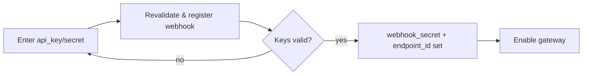
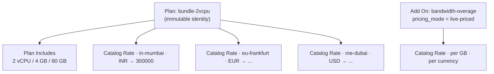

# 04 — Configuration

Everything an operator sets up before customers can be billed. Each section is a
DocType you configure in the Desk **Billing** workspace (or via the demo seed).

## 1. Roles & team scoping

The app creates two roles on `after_migrate` (no manual step):

| Role | Grants |
|---|---|
| `Billing Admin` | The admin console + all teams. `System Manager` and `Administrator` count as admin too. |
| `Billing User` | The customer portal, scoped to **their own team only**. |

A `Billing User` is tied to a team through the `User.billing_team` link field
(also created on migrate). In production this derives from real team membership;
here it is a User field so tests and the demo can set it.

> Guards live in `platform/security.py`: `require_billing_admin()` and
> `require_team_access(team)`. Every endpoint funnels through one of them, so an
> Agent API key (which holds neither role) gets a 403 on any billing endpoint.

## 2. Payment Gateways

DocType **Payment Gateway** — one row per gateway × currency.

| Field | Meaning |
|---|---|
| `adapter_key` | `stripe`, `razorpay`, or `paypal` — selects the adapter (`gateways/registry.py`). |
| `currency` | The currency this config charges in. |
| `is_default_for_currency` | The gateway picked when a team in this currency is charged. |
| `supports_mandates` | Whether it can host UPI Autopay mandates (Razorpay). |
| `api_key` / `api_secret` | Gateway credentials. |
| `webhook_secret` / `webhook_endpoint_id` | The HMAC secret + endpoint, set on validation. |
| `credentials_validated_at` | Timestamp; a gateway can't be enabled until validated. |

**Setup flow:** enter credentials → run the **Revalidate & register webhook**
action (`revalidate_and_register_webhook`). It re-checks the keys, (re)creates the
gateway-side webhook endpoint, and rotates the signing secret. Only then can
`is_enabled` be turned on.

> Secrets live in the bench's site config in dev — never echo or commit them; read
> via `frappe.conf`.

## 3. Catalog — what you sell

Four DocTypes work together:

- **Plan** — a flat-rate *bundle* with one immutable identity forever. Fields:
  `title`, `is_active`, `billing_cycle` (`monthly` / `annual`), optional
  `annual_discount_pct`, and `includes` (the composition).
- **Plan Includes** — the bundle's composition (compute / memory / disk). Spec
  only, **no price**; also the allowance baseline that overage is measured
  against.
- **Add On** — a per-unit resource billed on top of a bundle. Fields:
  `resource_type`, `unit`, `billing_type`, `pricing_mode` (grandfathered vs
  **live-priced**), `billing_interval`.
- **Catalog Rate** — the single rate table (ERPNext *Item Price* style). One row
  per `(priced_doctype, priced_for, cluster, currency)` → `rate`.

**The key rule:** a price change is a **new Catalog Rate document**, never a new
Plan and never a new column. A new currency or region is likewise a new Catalog
Rate document. Plan identity is forever.

**Rates are integers.** A bundle rate is the price itself, in **rate units**
(minor × 10⁶). A per-unit add-on rate is per-unit, also in rate units, so a
sub-paisa transfer rate is representable. See the [glossary](07-glossary.md).

## 4. Trust Tiers — the provisioning cap

DocType **Trust Tier** with child **Trust Tier Level** rows. Each level sets:

| Field | Meaning |
|---|---|
| `tier`, `sequence`, `is_default` | The tier identity + ordering; new teams start at the default. |
| `max_spend`, `max_resource_count` | The **caps** — how much / how many a team may provision. |
| `min_paid_invoices`, `min_cumulative_paid` | **Promotion thresholds** — billing history that earns the next tier. |
| `allowed_plans`, `allowed_clusters`, `allowed_resource_types` | What this tier may use. |

The tier is the cap baked into a team's **Entitlement Token** (signed Ed25519,
`catalog/signing.py`), which the Agent enforces offline. Promotion re-issues the
token; a UPI mandate is re-authorised to the new cap on promotion.

## 5. Tax — Tax Profile per team

DocType **Tax Profile** implements three orthogonal mechanics:

| Mechanic | Fields | Behaviour |
|---|---|---|
| **Output tax** (GST) | `output_tax_type`, `output_tax_rate` | Additive line on the invoice (e.g. 18% GST). |
| **Zero-rating** (SEZ/export) | `zero_rated`, `zero_rating_reason` | Tax set to zero, with a recorded reason. |
| **Withholding** (TDS) | `tds_applicable`, `tds_rate` | Seam for tax withheld at source. |

If a team has no Tax Profile, invoices carry no tax block.

## 6. Scheduler — the recurring jobs

Wired in `hooks.py`. These drive the lifecycle automatically:

| Cadence | Job | Purpose |
|---|---|---|
| daily | `revenue.dunning.run_dunning` | Retry/dunning + staged suspension for unpaid invoices |
| daily | `payments.reconciliation.run_reconciliation` | Catch charged-but-never-webhooked payments |
| daily | `payments.charges.cleanup_payment_logs` | Prune Payment Attempt + Webhook Event logs past 3 months |
| hourly | `revenue.erpnext_sync.retry_failed_syncs` | Retry ERPNext syncs whose backoff has elapsed |
| monthly | `payments.payments.expire_payment_methods` | Flip cards lapsed at month-end |

> Invoice generation itself (the 28th draft / 1st open two-phase) is described in
> [05 — Workflows](05-workflows.md).

## 7. Routing & SPA

`hooks.py` maps `/billing/<path>` to the `www/billing.html` shell so the
client-side router owns deep links. The SPA source is in `dashboard/`; build with
`yarn build` into `billing/public/dashboard/`.

Next: [05 — Workflows](05-workflows.md).
