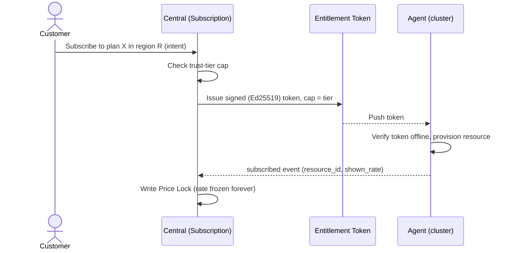
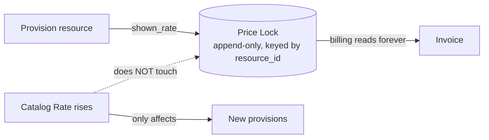
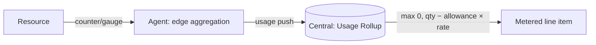
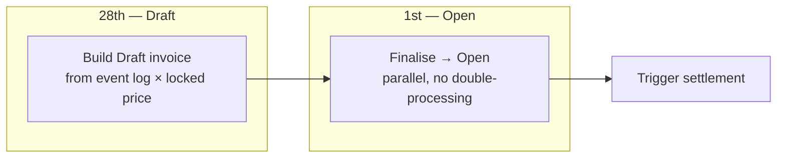
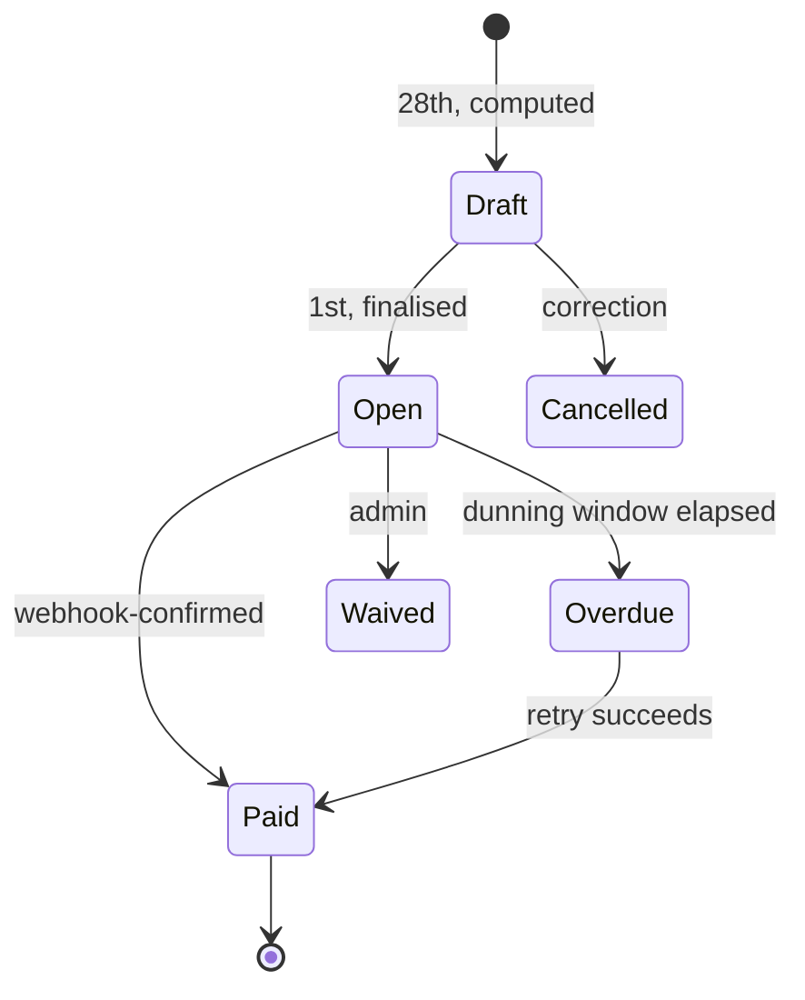
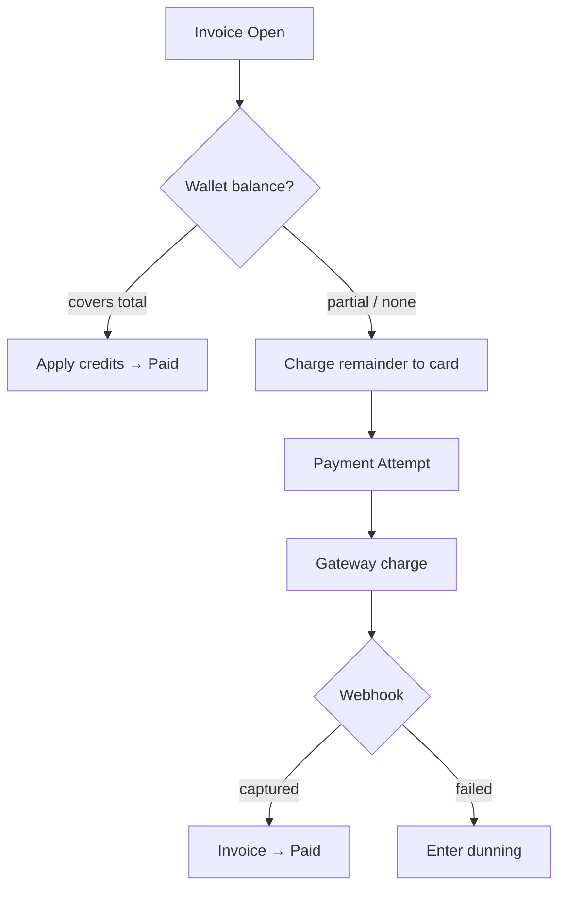
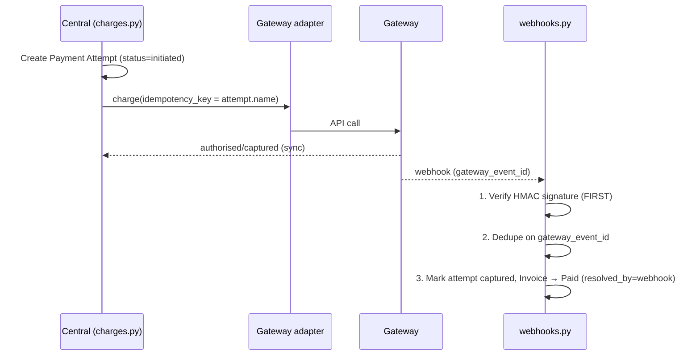
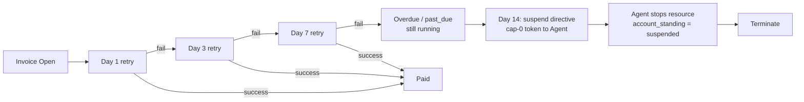
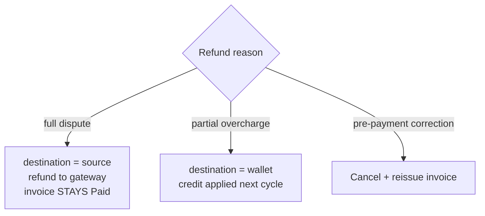
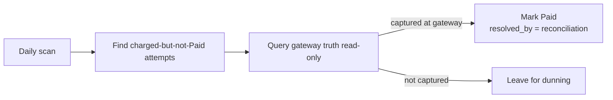

# 05 — Workflows

The end-to-end lifecycles, each backed by tests. Read these to understand *how
the pieces move together*. State names are the real DocType values.

---

## A. Subscription & the two-axis state

A customer *requests* a plan (intent, on Central). The cluster *provisions*
against a signed entitlement token. Two **orthogonal** state axes are tracked —
never collapse them into one enum.

| Axis | Owner | Values |
|---|---|---|
| **Operational** | Agent | `running` · `stopped` · `terminated` |
| **Account standing** | Central (`Subscription.account_standing`) | `current` · `past_due` · `suspended` |

Key points:

- **Provisioning is regional and Central-independent** — the Agent verifies the
  token offline, so a Central outage never blocks (or stops) a resource.
- On the `subscribed` event the Agent reports the `shown_rate`, so **rate shown =
  rate locked**, guaranteed.
- `stopped` is an *operational* state only — a stopped machine is still **alive**
  and bills the full bundle rate. Only `terminated` stops compute billing.

---

## B. Grandfathering (Price-Lock)

The **Price Lock** freezes the rate (and allowance) a specific `resource_id` was
shown at provision. Billing reads it forever — raising a Catalog Rate only affects
*new* provisions. Re-provisioning yields a new `resource_id` and a new lock.
(`acme-corp` demo: locked ₹9,360 vs ₹12,000 catalog → `discrepancy = 1`.)

The deliberate exception: **live-priced add-ons** (depreciating storage like
snapshots) read the *current* Catalog Rate each period, so the customer is never
stranded on a stale-high rate.

---

## C. Metering → usage rollup

Usage is **edge-aggregated on the Agent** (counters and gauges), so Central stores
bounded rollups, not 10M rows/day. A metered line bills
`max(0, quantity − allowance) × rate` — the allowance comes from the plan's
composition. Receive endpoints: `platform/sync.py:receive_usage_events` /
`receive_meter_rollups`.

---

## D. Two-phase invoicing

Postpaid: everything bills on the 1st for the month just ended. Generation is
split in two so the 1st is never a single blocking loop.

Invoice state machine:

- An invoice is **computed** from line items (`revenue/invoicing/lines.py`), never
  a stored "amount".
- `invoice_type` is `billable` normally, or `cost_report` for trials (computed,
  not charged).
- Each region a team occupies gets **one invoice per region per month** (multiple
  day-weighted line items).

---

## E. Settlement — credits-then-card waterfall

When an invoice opens, Central settles it. Credits apply first; the remainder
goes to the card.

- **Credits-only teams** (prepaid mode) are gated by `min(tier cap, wallet)`.
- A **credit shortfall** (wallet can't cover the month's projection) raises an
  alert (demo: `hooli`). The 80% forecast threshold drives early warning.
- Settlement source is gated by mode (postpaid → card, prepaid → credits).
  Code: `payments/settlement.py`.

---

## F. Charge → Payment Attempt → webhook → Paid

The only path to `Paid` is a **verified webhook**. The receiver is
**signature-first**: it verifies the gateway HMAC *before* any DB access.

- **Idempotency**: the charge carries an idempotency key derived from
  `payment_attempt.name`; webhooks dedupe on `gateway_event_id` (a concurrent
  flood stores exactly one).
- `Payment Attempt.status`: `initiated → authorised → captured → failed →
  refunded`. `resolved_by` records provenance: `webhook` or `reconciliation`.

### Payment-method fallback

If the primary method fails, collection walks the team's methods in priority
order (`payments/collection.py`) — **escalate, don't repeat** the same method; a
duplicate card is deduped.

---

## G. Dunning → suspend → terminate

The daily `run_dunning` job walks unpaid invoices through a staged ladder. The
suspend directive travels on the **entitlement-token channel** — Central being
unreachable never stops a resource; only an explicit cap-0 suspend token does.

Critical distinction (demo `stark-ind` vs `cyberdyne`): a team in `past_due` keeps
**running**; an *expired* token never stops a customer's resources. Only a
**suspend token** (cap 0) makes the Agent stop them.

---

## H. Refunds

Two shapes, by intent (`payments/refunds.py`, `Refund.destination`):

A full dispute refunds to the original **source** and the invoice stays `Paid`
(money moved, the bill was still valid). A partial overcharge becomes a **wallet
credit** (demo `soylent`). A correction *before* payment is a cancel + reissue.

---

## I. Reconciliation

The daily `run_reconciliation` job is a **read-only** scan for charges that
succeeded at the gateway but whose webhook never arrived.

It is idempotent (no double charge) and records `resolved_by = reconciliation` so
the provenance of every `Paid` is auditable. Human-in-the-loop decisions are
recorded too.

---

## J. Trials (trial = entry tier)

A trial is simply the **entry trust tier**. Its invoices are
`invoice_type = cost_report` — **computed, not charged** — so you can see what a
team *would* owe (and the subsidy). Converting flips invoices to `billable` with
resources untouched (`catalog/trials.py`). Demo: `piedpiper`.

---

## K. ERPNext sync (async, one-way)

After an invoice is `Paid`, Central enqueues a one-way **Sales Invoice** push to
ERPNext (the statutory accounting SOR). It uses exponential-backoff retries
(hourly `retry_failed_syncs`) and is **failure-isolated**: a sync failure never
rolls back the customer invoice. `erpnext_sync_status`: `pending → synced →
failed`.

---

Next: [06 — Actions & API reference](06-actions.md).
