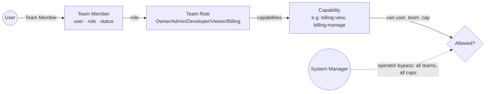
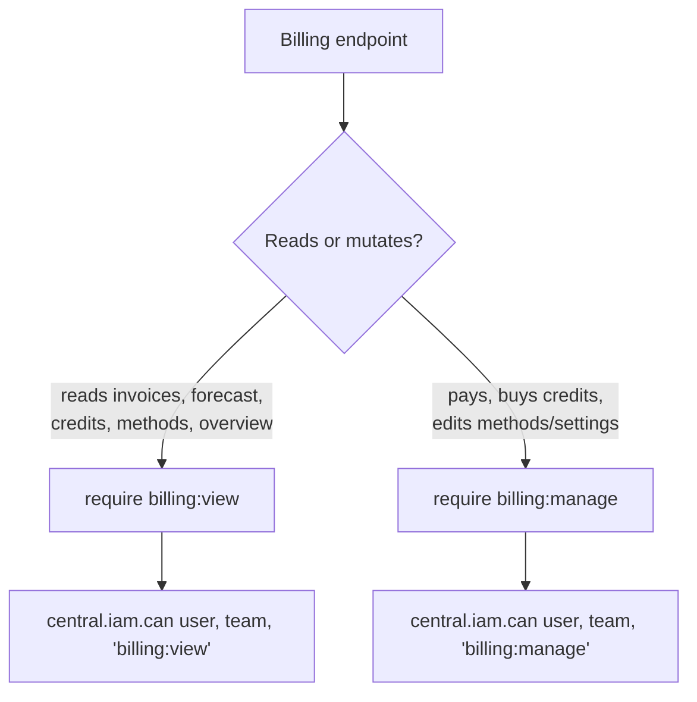
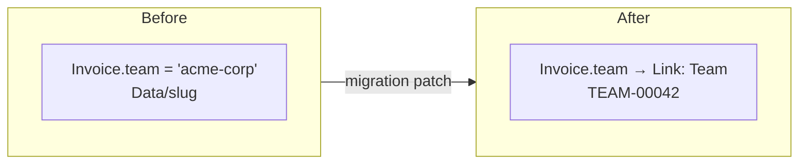
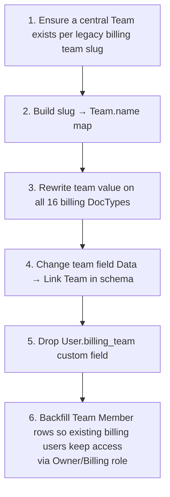

# 08 — Merging Billing into Central (as a module)

This is the plan to fold the standalone **Billing** app into **Central**
(`frappe/central`) as a `billing` module, and — most importantly — to **adopt
Central's IAM** (Team / Team Role / Capability) in place of Billing's bespoke
`Billing Admin` / `Billing User` roles.

Read [03 — Architecture](03-architecture.md) and [04 — Configuration](04-configuration.md)
first; this doc assumes you know the current auth model.

---

## 1. Why & the end state

Billing was built standalone with its own two Frappe roles + a `User.billing_team`
field. Central already ships a richer, team-scoped, **capability-based** IAM that
Atlas and the team console also use. Two parallel authz models cannot coexist —
Billing must drop its own and call Central's.

**End state:** Billing is a module inside the `central` app. Every customer
billing endpoint authorises with `central.iam.can(user, team, "billing:…")`;
cross-team/operator views use Central's operator bypass. No `Billing Admin` /
`Billing User` roles, no `User.billing_team` field.

---

## 2. Central's IAM, in one picture



The seam Billing must call lives in **`central/iam.py`**:

| Function | Use in Billing |
|---|---|
| `can(user, team, capability) -> bool` | The per-team authorization check. |
| `user_has_operator_bypass(user) -> bool` | Platform-staff bypass (`System Manager`). |
| `get_user_team_names(user) -> list[str]` | Teams a user belongs to (team scoping / default team). |
| `get_user_team_names_with_capability(user, cap)` | Teams where the user holds a capability. |

These are already exercised by `central/permissions.py` (the `has_permission` /
`permission_query_conditions` hooks for Team, Team Invitation, Team Role).

### The billing capabilities already exist

From `central/fixtures/capability.json` (`plane: central`, `resource: billing`):

| Capability | Description |
|---|---|
| `billing:view` | View billing data. |
| `billing:manage` | Manage billing settings and payment operations. |

And from `central/fixtures/team_role.json`, the system Team Roles that carry them:

| Team Role | `billing:view` | `billing:manage` |
|---|:--:|:--:|
| **Owner** | ✅ | ✅ |
| **Billing** | ✅ | ✅ |
| Admin | — | — |
| Developer | — | — |
| Viewer | — | — |

> So a team's **Owner** or anyone given the **Billing** role can see and manage
> billing; Admin/Developer/Viewer cannot. Billing inherits this for free — it
> defines **no new roles**.

---

## 3. Authorization mapping (the core of the merge)

Replace Billing's guards (`billing.platform.security`) with Central capabilities.

| Billing today | Central equivalent | Applies to |
|---|---|---|
| `require_team_access(team)` (read) | `can(user, team, "billing:view")` | All customer **read** endpoints |
| `require_team_access(team)` (mutation) | `can(user, team, "billing:manage")` | `pay_invoice`, `purchase_credits`, top-up, payment-method add/remove/default/reorder, `save_billing_profile`, `save_billing_settings` |
| `require_billing_admin()` | `user_has_operator_bypass(user)` (System Manager) | Admin console (cross-team MRR, all teams) |
| `get_user_team()` (`User.billing_team`) | `get_user_team_names(user)` + selected-team context | Default-team resolution |
| `is_billing_admin()` | `user_has_operator_bypass(user)` | Admin/default fallbacks |

**Split read vs manage.** Today Billing has one gate (`require_team_access`).
Central distinguishes **view** from **manage**, so endpoints must be classified:



### The admin-console question (a decision to make)

Billing's admin console is **cross-team** (platform MRR, delinquency, every
team's data). Central's only cross-team bypass is the **`System Manager`**
operator role. Two options:

1. **Use operator bypass (smallest change).** Gate the admin API on
   `user_has_operator_bypass(user)`. Fine if only platform engineers/SysMgr use
   it.
2. **Add a platform capability (cleaner long-term).** Define a new Capability,
   e.g. `billing:operate` (plane `central`, resource `billing`), and a Central
   *operator* role/seat that finance staff hold without full `System Manager`.
   This needs a Central-side notion of platform-staff seats that is team-agnostic.

> **Recommendation:** ship with (1) to unblock the merge; track (2) as a
> follow-up with the Central team, since cross-team staff authz is a Central
> concern, not a Billing one. **Confirm with the Central owners before coding.**

---

## 4. Identity & team-model change

Billing's `team` is a **`Data`** field holding a slug (`acme-corp`) on 16
DocTypes. Central's team is the **`Team`** DocType (`TEAM-#####`, with
`team_name`, `members`, `status`).



Required changes:

- Change `team` from `Data` → **`Link` (Team)** on all 16 billing DocTypes
  (`subscription`, `invoice`, `price_lock`, `credit_wallet`,
  `credit_ledger_entry`, `payment_method`, `payment_attempt`, `refund`,
  `commitment`, `usage_rollup`, `tax_profile`, `billing_profile`,
  `entitlement_token`, `trust_tier`, `notification_log`,
  `notification_preference`).
- **Drop** the `User.billing_team` custom field and its `ensure_billing_team_field`
  hook.
- **Team context for the portal:** today a Billing User has exactly one team
  (the field). Central users can belong to **many** teams, so the portal needs a
  *selected team* (a request header / param) resolved against
  `get_user_team_names(user)` — reuse whatever Central's console already uses for
  "current team". The existing `list_switchable_teams` endpoint maps onto
  `get_user_team_names`.

---

## 5. Code relocation & module layout

Vendor the **backend** `billing/` package into Central as a module directory;
keep the internal structure intact.

```
central/central/
├── billing/                 ← the backend billing/ tree moves here
│   ├── api/ catalog/ revenue/ payments/ gateways/ platform/ …
│   └── doctype/             ← 25 billing DocTypes, module = "Billing"
```

### What does NOT migrate — the dashboard UI

**The Billing SPA is not migrated.** Central's UI is being rebuilt and will
diverge substantially from what Billing shipped, so the frontend is dropped at
the boundary and Central owns the new screens. Concretely, **leave behind**:

- `dashboard/` (the Vue 3 + Frappe-UI source) and its build tooling.
- `billing/public/dashboard/` (the built bundle), `billing/www/billing.html`
  (the SPA shell), and the `/billing/<path>` `website_route_rules` that serve it.
- Any SPA-only templates under `billing/templates/`.

**What stays (the contract the new UI consumes):** all the whitelisted **API
endpoints** under `billing/api/dashboard/` and `billing/api/admin/` — these are
the backend surface Central's new dashboard will call. The line-item humaniser
and team/currency helpers in `api/**/_shared.py` are backend and migrate too.

> Net: migrate the **data model + business logic + API**, not the **rendered UI**.
> The endpoints keep their dotted paths so Central's frontend can call them
> unchanged.

- **Imports:** `billing.<x>` → `central.billing.<x>` (mechanical, repo-wide).
- **DocType `module`:** set every billing DocType's module to **"Billing"** and
  add `Billing` to Central's `modules.txt`.
- **`platform/security.py`:** delete it; its callers now import from
  `central.iam`. Keep a thin `central/billing/authz.py` only if you want
  billing-named wrappers (`require_billing_view(team)` →
  `frappe.throw unless can(...)`), which keeps endpoint code readable.
- **License:** Billing is MIT, Central is **AGPL-3.0** — the merged module takes
  Central's AGPL header. Update file headers.
- **Type annotations:** Central sets `require_type_annotated_api_methods = True`
  and `export_python_type_annotations = True`. **Every** whitelisted billing
  method must have full parameter + return type annotations before it will load
  under Central. Budget time for this — it is enforced, not advisory.

---

## 6. Fixtures, hooks & roles

### Fixtures

- **Do not** add billing Frappe roles. Billing contributes **zero** new
  `Role`/`Team Role` fixtures (it reuses Owner/Billing).
- If decision §3 lands on a new capability (`billing:operate`), add it to
  Central's `capability.json` and grant it to the relevant role — a **Central**
  fixtures change, reviewed by Central owners.

### Hooks (merge `billing/hooks.py` into `central/hooks.py`)

| Billing hook | Action on merge |
|---|---|
| `website_route_rules` (`/billing/<path>`) | **Drop** — it serves the old SPA shell (§5); Central owns the new UI routing. |
| `scheduler_events` (dunning, reconciliation, log cleanup, erpnext retry, expire methods) | Merge into Central's `scheduler_events`. |
| `after_migrate` = `ensure_billing_roles`, `ensure_billing_team_field` | **Delete both** — roles come from Central fixtures; the team field is gone. |
| `override_doctype_dashboards` (Currency) | Merge into Central's (backend desk dashboard — keep). |

---

## 7. Data migration (patches)

A patch under `central/patches/` (idempotent), run once on the merged site:



Step 6 is the access-continuity step: every user who could reach a team's billing
before must be a `Team Member` of the matching `Team` with a role granting
`billing:view`/`billing:manage` — otherwise they lose access at cutover.

---

## 8. Phased execution

Each phase is independently shippable and testable.

| Phase | Goal | Done when |
|---|---|---|
| **0. Spike** | Confirm §3 admin-console decision with Central owners; confirm "current team" mechanism | Decisions recorded |
| **1. Vendor in** | Move `billing/` → `central/central/billing/`, fix imports, set module, AGPL headers, type-annotate APIs | App boots under Central, billing tests green via compat shim |
| **2. Auth seam** | Replace `platform/security` calls with `central.iam.can` (view/manage split); admin → operator bypass | Capability-based authz tests pass; old roles unused |
| **3. Team model** | `team` Data→Link(Team); migration patch; drop `billing_team` field; portal selected-team context | Migration runs idempotently; portal scopes by Team |
| **4. Fixtures/hooks** | Merge hooks; remove `ensure_billing_roles`/field hooks; (optional) new capability | `bench migrate` clean; no orphan roles |
| **5. Cleanup** | Delete `platform/security.py`, dead shims, update docs (this set) | No reference to `Billing Admin`/`Billing User` remains |

---

## 9. Risks & open decisions

- **Cross-team admin authz (§3)** — operator bypass vs a new platform capability.
  *Decision owner: Central team.*
- **Multi-team users** — Billing assumed one team per user; Central allows many.
  The portal needs an explicit current-team selector. Reuse Central's existing
  mechanism rather than inventing one.
- **Type-annotation gate** — Central rejects un-annotated whitelisted methods at
  load. Non-negotiable pre-req for Phase 1.
- **Naming** — both apps speak of "team"; ensure billing's `Trust Tier`, demo
  seeds, and tests reference the central `Team`, not slugs.
- **License** — MIT → AGPL on the moved files.
- **Demo seeds** — `billing.demo.demo_scenarios` creates slug teams; rewrite to
  create central `Team` + `Team Member` rows so the demo's authz is real.
- **UI is out of scope** — the Billing SPA is intentionally **not** migrated (§5);
  Central rebuilds the dashboard against the same APIs. Do not port `dashboard/`,
  the `/billing` route, or the SPA shell. This plan covers backend + API only.

---

## 10. Test strategy

- Run both suites through every phase: Billing's `run-tests --app` (now under
  Central) + Central's IAM tests.
- **New authz tests** (replace `tests/test_hardening.py` role checks):
  - A `Viewer`/`Developer` team member is denied billing endpoints (no
    `billing:view`).
  - A `Billing`/`Owner` member is allowed view + manage.
  - A non-member of the team is denied (no widening via a passed `team`).
  - `System Manager` (operator) reaches the admin console; a plain member does
    not.
- Keep the existing concurrency proofs (credit double-spend, parallel invoice
  open, webhook flood) — they are orthogonal to authz and must stay green.

---

## Appendix — current Billing guards being retired

`billing/platform/security.py`: `BILLING_ADMIN`, `BILLING_USER`,
`ensure_billing_roles`, `is_billing_admin`, `require_billing_admin`,
`get_user_team`, `require_team_access`. Call sites: the dashboard/admin
`_shared.py` chokepoints + per-endpoint admin guards (~13 files). The
single customer chokepoint is `api/dashboard/_shared.py:_resolve_team`, which is
where `can(user, team, "billing:view")` slots in.
