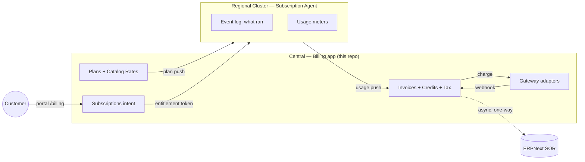

# Billing — Documentation

The **Billing** app is the money system of record for Frappe Cloud v2 (Central).
It owns plans & pricing, subscriptions, invoices, credits, taxes, payment
gateways, trust tiers, dunning, refunds, and the customer/admin dashboards.

> **One principle everything hangs off:**
> The regional **Agent** is the source of truth for *what actually ran*; **Central
> (this app)** owns *intent + money*. A customer can *request* a plan, but is
> *billed* for what the cluster actually ran.

## Start here

| If you want to… | Read |
|---|---|
| Understand what the app is and the mental model | [01 — Overview](01-overview.md) |
| Stand it up locally and take your first steps | [02 — Onboarding](02-onboarding.md) |
| See how the code is organised and how data flows | [03 — Architecture](03-architecture.md) |
| Configure gateways, plans, tiers, tax, roles | [04 — Configuration](04-configuration.md) |
| Follow an end-to-end lifecycle (with diagrams) | [05 — Workflows](05-workflows.md) |
| Look up an API endpoint or operator action | [06 — Actions & API reference](06-actions.md) |
| Resolve a term ("price-lock", "floor", "minor unit") | [07 — Glossary](07-glossary.md) |

## The 60-second picture

- **Postpaid / in-arrears**: billed on the 1st for the month just ended. No charge
  at sign-up.
- **Invoice is computed**, not stored: Agent event log (what ran) × Central's
  locked prices.
- **Money is integer minor units** (paisa/cent) end to end — never floats.

## Conventions used in these docs

- **Central** = this `billing` app, running on site `billing.local` in dev.
- **Agent** = the separate `press_billing_agent` app, on site `agent.local`.
- Code references are written as `module.path:function` and map to
  `billing/<module>.py` under the app root.
